<!-- Generated by `qits database diagram` (jpa). Do not edit: the entity-diagram automation rewrites this file on every release request fold. -->
# Persistence unit `configuration`

Datasource `configuration` · package `eu.wohlben.qits.configuration.entity` · 5 entities

```mermaid
erDiagram
  %% configuration_declaration: eu.wohlben.qits.configuration.entity.ConfigurationDeclaration (configuration)
  configuration_declaration {
    uuid id PK "not null"
    string application UK "not null, length 64"
    string content_hash "not null, length 64"
    string deployment_target "not null, length 32"
    text raw "not null"
    instant received_at "not null"
    string received_by "length 255"
    string version UK "not null, length 128"
  }
  %% configuration_declaration_revision: eu.wohlben.qits.configuration.entity.ConfigurationDeclarationRevision (configuration)
  configuration_declaration_revision {
    long seq PK "not null, generated"
    string application "not null, length 64"
    string content_hash "length 64"
    boolean deleted "not null"
    instant received_at "not null"
    string received_by "length 255"
    string version "not null, length 128"
  }
  %% configuration_declared_key: eu.wohlben.qits.configuration.entity.ConfigurationDeclaredKey (configuration)
  configuration_declared_key {
    uuid id PK "not null"
    string application UK "not null, length 64"
    text default_value
    string key UK "not null, length 256"
    string package_name "length 255"
    string package_type "length 32"
    int service_port
    string service_ref "length 64"
    string type "not null, length 32"
    string version UK "not null, length 128"
  }
  %% configuration_entry: eu.wohlben.qits.configuration.entity.ConfigurationEntry (configuration)
  configuration_entry {
    uuid id PK "not null"
    string application UK "not null, length 64"
    string class "not null, length 32"
    string env UK "not null, length 64"
    long head_revision "not null"
    string key UK "not null, length 256"
    instant updated_at "not null"
    string updated_by "length 255"
    text value "not null"
  }
  %% configuration_revision: eu.wohlben.qits.configuration.entity.ConfigurationRevision (configuration)
  configuration_revision {
    long seq PK "not null, generated"
    string application "not null, length 64"
    boolean deleted "not null"
    string env "not null, length 64"
    string key "not null, length 256"
    instant updated_at "not null"
    string updated_by "length 255"
    text value
  }
```

